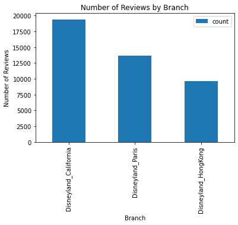
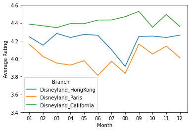
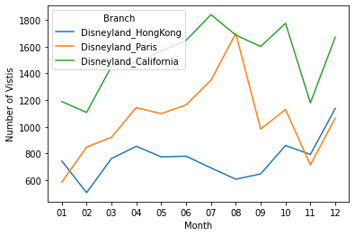
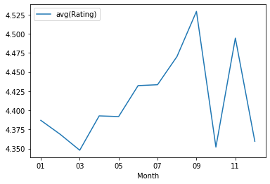
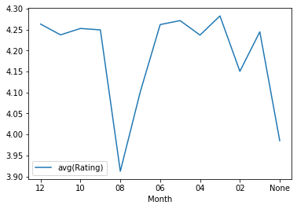
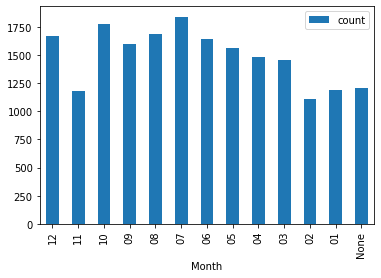
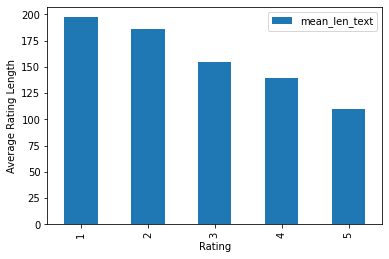
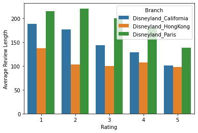

**Setting up Spark on our Colab environment.**


```python
!apt-get update
```

    Get:1 https://cloud.r-project.org/bin/linux/ubuntu bionic-cran40/ InRelease [3,626 B]
    Ign:2 https://developer.download.nvidia.com/compute/cuda/repos/ubuntu1804/x86_64  InRelease
    Ign:3 https://developer.download.nvidia.com/compute/machine-learning/repos/ubuntu1804/x86_64  InRelease
    Get:4 http://security.ubuntu.com/ubuntu bionic-security InRelease [88.7 kB]
    Get:5 http://ppa.launchpad.net/c2d4u.team/c2d4u4.0+/ubuntu bionic InRelease [15.9 kB]
    Hit:6 http://archive.ubuntu.com/ubuntu bionic InRelease
    Get:7 https://developer.download.nvidia.com/compute/cuda/repos/ubuntu1804/x86_64  Release [697 B]
    Hit:8 https://developer.download.nvidia.com/compute/machine-learning/repos/ubuntu1804/x86_64  Release
    Get:9 https://developer.download.nvidia.com/compute/cuda/repos/ubuntu1804/x86_64  Release.gpg [836 B]
    Get:10 http://archive.ubuntu.com/ubuntu bionic-updates InRelease [88.7 kB]
    Get:11 https://cloud.r-project.org/bin/linux/ubuntu bionic-cran40/ Packages [55.5 kB]
    Hit:12 http://ppa.launchpad.net/cran/libgit2/ubuntu bionic InRelease
    Get:13 http://archive.ubuntu.com/ubuntu bionic-backports InRelease [74.6 kB]
    Get:14 http://ppa.launchpad.net/deadsnakes/ppa/ubuntu bionic InRelease [15.9 kB]
    Get:16 http://ppa.launchpad.net/graphics-drivers/ppa/ubuntu bionic InRelease [21.3 kB]
    Ign:17 https://developer.download.nvidia.com/compute/cuda/repos/ubuntu1804/x86_64  Packages
    Get:17 https://developer.download.nvidia.com/compute/cuda/repos/ubuntu1804/x86_64  Packages [770 kB]
    Get:18 http://ppa.launchpad.net/c2d4u.team/c2d4u4.0+/ubuntu bionic/main Sources [1,759 kB]
    Get:19 http://security.ubuntu.com/ubuntu bionic-security/universe amd64 Packages [1,410 kB]
    Get:20 http://archive.ubuntu.com/ubuntu bionic-updates/main amd64 Packages [2,550 kB]
    Get:21 http://security.ubuntu.com/ubuntu bionic-security/multiverse amd64 Packages [24.7 kB]
    Get:22 http://security.ubuntu.com/ubuntu bionic-security/main amd64 Packages [2,119 kB]
    Get:23 http://security.ubuntu.com/ubuntu bionic-security/restricted amd64 Packages [399 kB]
    Get:24 http://ppa.launchpad.net/c2d4u.team/c2d4u4.0+/ubuntu bionic/main amd64 Packages [900 kB]
    Get:25 http://archive.ubuntu.com/ubuntu bionic-updates/multiverse amd64 Packages [31.6 kB]
    Get:26 http://archive.ubuntu.com/ubuntu bionic-updates/universe amd64 Packages [2,182 kB]
    Get:27 http://archive.ubuntu.com/ubuntu bionic-updates/restricted amd64 Packages [429 kB]
    Get:28 http://ppa.launchpad.net/deadsnakes/ppa/ubuntu bionic/main amd64 Packages [40.8 kB]
    Get:29 http://ppa.launchpad.net/graphics-drivers/ppa/ubuntu bionic/main amd64 Packages [49.5 kB]
    Fetched 13.0 MB in 4s (3,631 kB/s)
    Reading package lists... Done


```python
!pip install pyspark
!pip install -U -q PyDrive
!apt install openjdk-8-jdk-headless -qq
import os
os.environ["JAVA_HOME"] = "/usr/lib/jvm/java-8-openjdk-amd64"
```

    Requirement already satisfied: pyspark in /usr/local/lib/python3.7/dist-packages (3.1.1)
    Requirement already satisfied: py4j==0.10.9 in /usr/local/lib/python3.7/dist-packages (from pyspark) (0.10.9)
    The following package was automatically installed and is no longer required:
      libnvidia-common-460
    Use 'apt autoremove' to remove it.
    The following additional packages will be installed:
      openjdk-8-jre-headless
    Suggested packages:
      openjdk-8-demo openjdk-8-source libnss-mdns fonts-dejavu-extra
      fonts-ipafont-gothic fonts-ipafont-mincho fonts-wqy-microhei
      fonts-wqy-zenhei fonts-indic
    The following NEW packages will be installed:
      openjdk-8-jdk-headless openjdk-8-jre-headless
    0 upgraded, 2 newly installed, 0 to remove and 95 not upgraded.
    Need to get 36.5 MB of archives.
    After this operation, 143 MB of additional disk space will be used.
    Selecting previously unselected package openjdk-8-jre-headless:amd64.
    (Reading database ... 160690 files and directories currently installed.)
    Preparing to unpack .../openjdk-8-jre-headless_8u292-b10-0ubuntu1~18.04_amd64.deb ...
    Unpacking openjdk-8-jre-headless:amd64 (8u292-b10-0ubuntu1~18.04) ...
    Selecting previously unselected package openjdk-8-jdk-headless:amd64.
    Preparing to unpack .../openjdk-8-jdk-headless_8u292-b10-0ubuntu1~18.04_amd64.deb ...
    Unpacking openjdk-8-jdk-headless:amd64 (8u292-b10-0ubuntu1~18.04) ...
    Setting up openjdk-8-jre-headless:amd64 (8u292-b10-0ubuntu1~18.04) ...
    update-alternatives: using /usr/lib/jvm/java-8-openjdk-amd64/jre/bin/orbd to provide /usr/bin/orbd (orbd) in auto mode
    update-alternatives: using /usr/lib/jvm/java-8-openjdk-amd64/jre/bin/servertool to provide /usr/bin/servertool (servertool) in auto mode
    update-alternatives: using /usr/lib/jvm/java-8-openjdk-amd64/jre/bin/tnameserv to provide /usr/bin/tnameserv (tnameserv) in auto mode
    Setting up openjdk-8-jdk-headless:amd64 (8u292-b10-0ubuntu1~18.04) ...
    update-alternatives: using /usr/lib/jvm/java-8-openjdk-amd64/bin/idlj to provide /usr/bin/idlj (idlj) in auto mode
    update-alternatives: using /usr/lib/jvm/java-8-openjdk-amd64/bin/wsimport to provide /usr/bin/wsimport (wsimport) in auto mode
    update-alternatives: using /usr/lib/jvm/java-8-openjdk-amd64/bin/jsadebugd to provide /usr/bin/jsadebugd (jsadebugd) in auto mode
    update-alternatives: using /usr/lib/jvm/java-8-openjdk-amd64/bin/native2ascii to provide /usr/bin/native2ascii (native2ascii) in auto mode
    update-alternatives: using /usr/lib/jvm/java-8-openjdk-amd64/bin/javah to provide /usr/bin/javah (javah) in auto mode
    update-alternatives: using /usr/lib/jvm/java-8-openjdk-amd64/bin/hsdb to provide /usr/bin/hsdb (hsdb) in auto mode
    update-alternatives: using /usr/lib/jvm/java-8-openjdk-amd64/bin/clhsdb to provide /usr/bin/clhsdb (clhsdb) in auto mode
    update-alternatives: using /usr/lib/jvm/java-8-openjdk-amd64/bin/extcheck to provide /usr/bin/extcheck (extcheck) in auto mode
    update-alternatives: using /usr/lib/jvm/java-8-openjdk-amd64/bin/schemagen to provide /usr/bin/schemagen (schemagen) in auto mode
    update-alternatives: using /usr/lib/jvm/java-8-openjdk-amd64/bin/xjc to provide /usr/bin/xjc (xjc) in auto mode
    update-alternatives: using /usr/lib/jvm/java-8-openjdk-amd64/bin/jhat to provide /usr/bin/jhat (jhat) in auto mode
    update-alternatives: using /usr/lib/jvm/java-8-openjdk-amd64/bin/wsgen to provide /usr/bin/wsgen (wsgen) in auto mode


```python
from google.colab import drive
drive.mount('/content/drive')
```

    Drive already mounted at /content/drive; to attempt to forcibly remount, call drive.mount("/content/drive", force_remount=True).


```python
import os
cur_path = "/content/drive/MyDrive/Colab Notebooks/Big Data/Final Project/"
os.chdir(cur_path)
!pwd
```

    /content/drive/MyDrive/Colab Notebooks/Big Data/Final Project


```python
from pyspark.sql import SparkSession
spark = SparkSession.builder.appName('final_project').getOrCreate()
```


```python
from pyspark import SparkConf, SparkContext
from pyspark.sql import SQLContext
#sc= SparkContext()
sqlContext = SQLContext(spark)
data = spark.read.csv(cur_path + 'DisneylandReviews.csv',inferSchema=True,header=True)
```


```python
data.show()
```

    +---------+------+----------+--------------------+--------------------+-------------------+
    |Review_ID|Rating|Year_Month|   Reviewer_Location|         Review_Text|             Branch|
    +---------+------+----------+--------------------+--------------------+-------------------+
    |670772142|     4|    2019-4|           Australia|If you've ever be...|Disneyland_HongKong|
    |670682799|     4|    2019-5|         Philippines|Its been a while ...|Disneyland_HongKong|
    |670623270|     4|    2019-4|United Arab Emirates|Thanks God it was...|Disneyland_HongKong|
    |670607911|     4|    2019-4|           Australia|HK Disneyland is ...|Disneyland_HongKong|
    |670607296|     4|    2019-4|      United Kingdom|the location is n...|Disneyland_HongKong|
    |670591897|     3|    2019-4|           Singapore|Have been to Disn...|Disneyland_HongKong|
    |670585330|     5|    2019-4|               India|Great place! Your...|Disneyland_HongKong|
    |670574142|     3|    2019-3|            Malaysia|Think of it as an...|Disneyland_HongKong|
    |670571027|     2|    2019-4|           Australia|Feel so let down ...|Disneyland_HongKong|
    |670570869|     5|    2019-3|               India|I can go on talki...|Disneyland_HongKong|
    |670443403|     5|    2019-4|       United States|Disneyland never ...|Disneyland_HongKong|
    |670435886|     5|    2019-4|              Canada|We spent the day ...|Disneyland_HongKong|
    |670376905|     4|    2019-4|           Australia|We spend two days...|Disneyland_HongKong|
    |670324965|     5|    2019-4|         Philippines|It was indeed the...|Disneyland_HongKong|
    |670274554|     5|    2018-9|           Australia|This place is HUG...|Disneyland_HongKong|
    |670205135|     3|    2019-1|      United Kingdom|We brought ticket...|Disneyland_HongKong|
    |670199487|     4|    2019-4|     Myanmar (Burma)|Its huge , not en...|Disneyland_HongKong|
    |670129921|     3|    2019-4|      United Kingdom|Around   60 per p...|Disneyland_HongKong|
    |670099231|     4|    2019-4|           Australia|It   s Disneyland...|Disneyland_HongKong|
    |670033848|     5|   2018-11|           Hong Kong|There is nothing ...|Disneyland_HongKong|
    +---------+------+----------+--------------------+--------------------+-------------------+
    only showing top 20 rows
    


```python
print((data.count(), len(data.columns)))
```

    (42656, 6)


##### Our dataset has 42,656 rows and 8 columns.

#### **Checking for NA values:**


```python
from pyspark.sql.functions import isnan, when, count, col

data.select([count(when(isnan(c), c)).alias(c) for c in data.columns]).show()
```

    +---------+------+----------+-----------------+-----------+------+
    |Review_ID|Rating|Year_Month|Reviewer_Location|Review_Text|Branch|
    +---------+------+----------+-----------------+-----------+------+
    |        0|     0|         0|                0|          0|     0|
    +---------+------+----------+-----------------+-----------+------+
    


```python
data.printSchema()
```

    root
     |-- Review_ID: integer (nullable = true)
     |-- Rating: integer (nullable = true)
     |-- Year_Month: string (nullable = true)
     |-- Reviewer_Location: string (nullable = true)
     |-- Review_Text: string (nullable = true)
     |-- Branch: string (nullable = true)
    


#### **changing date column to type datetime**


```python
from pyspark.sql.types import TimestampType 
from pyspark.sql.types import DateType 

data = data.withColumn('Year_Month', data['Year_Month'].cast(DateType()))
```


```python
data.printSchema()
```

    root
     |-- Review_ID: integer (nullable = true)
     |-- Rating: integer (nullable = true)
     |-- Year_Month: date (nullable = true)
     |-- Reviewer_Location: string (nullable = true)
     |-- Review_Text: string (nullable = true)
     |-- Branch: string (nullable = true)
    


```python
data.show()
```

    +---------+------+----------+--------------------+--------------------+-------------------+
    |Review_ID|Rating|Year_Month|   Reviewer_Location|         Review_Text|             Branch|
    +---------+------+----------+--------------------+--------------------+-------------------+
    |670772142|     4|2019-04-01|           Australia|If you've ever be...|Disneyland_HongKong|
    |670682799|     4|2019-05-01|         Philippines|Its been a while ...|Disneyland_HongKong|
    |670623270|     4|2019-04-01|United Arab Emirates|Thanks God it was...|Disneyland_HongKong|
    |670607911|     4|2019-04-01|           Australia|HK Disneyland is ...|Disneyland_HongKong|
    |670607296|     4|2019-04-01|      United Kingdom|the location is n...|Disneyland_HongKong|
    |670591897|     3|2019-04-01|           Singapore|Have been to Disn...|Disneyland_HongKong|
    |670585330|     5|2019-04-01|               India|Great place! Your...|Disneyland_HongKong|
    |670574142|     3|2019-03-01|            Malaysia|Think of it as an...|Disneyland_HongKong|
    |670571027|     2|2019-04-01|           Australia|Feel so let down ...|Disneyland_HongKong|
    |670570869|     5|2019-03-01|               India|I can go on talki...|Disneyland_HongKong|
    |670443403|     5|2019-04-01|       United States|Disneyland never ...|Disneyland_HongKong|
    |670435886|     5|2019-04-01|              Canada|We spent the day ...|Disneyland_HongKong|
    |670376905|     4|2019-04-01|           Australia|We spend two days...|Disneyland_HongKong|
    |670324965|     5|2019-04-01|         Philippines|It was indeed the...|Disneyland_HongKong|
    |670274554|     5|2018-09-01|           Australia|This place is HUG...|Disneyland_HongKong|
    |670205135|     3|2019-01-01|      United Kingdom|We brought ticket...|Disneyland_HongKong|
    |670199487|     4|2019-04-01|     Myanmar (Burma)|Its huge , not en...|Disneyland_HongKong|
    |670129921|     3|2019-04-01|      United Kingdom|Around   60 per p...|Disneyland_HongKong|
    |670099231|     4|2019-04-01|           Australia|It   s Disneyland...|Disneyland_HongKong|
    |670033848|     5|2018-11-01|           Hong Kong|There is nothing ...|Disneyland_HongKong|
    +---------+------+----------+--------------------+--------------------+-------------------+
    only showing top 20 rows
    


```python
from pyspark.sql import functions as F
data = data.withColumn('Month',F.from_unixtime(F.unix_timestamp(col('Year_Month'),'yyyy-MM-dd'),'MM'))
```


```python
data = data.withColumn('Year',F.from_unixtime(F.unix_timestamp(col('Year_Month'),'yyyy-MM-dd'),'yyyy'))
```


```python
data.show()
```

    +---------+------+----------+--------------------+--------------------+-------------------+-----+----+
    |Review_ID|Rating|Year_Month|   Reviewer_Location|         Review_Text|             Branch|Month|Year|
    +---------+------+----------+--------------------+--------------------+-------------------+-----+----+
    |670772142|     4|2019-04-01|           Australia|If you've ever be...|Disneyland_HongKong|   04|2019|
    |670682799|     4|2019-05-01|         Philippines|Its been a while ...|Disneyland_HongKong|   05|2019|
    |670623270|     4|2019-04-01|United Arab Emirates|Thanks God it was...|Disneyland_HongKong|   04|2019|
    |670607911|     4|2019-04-01|           Australia|HK Disneyland is ...|Disneyland_HongKong|   04|2019|
    |670607296|     4|2019-04-01|      United Kingdom|the location is n...|Disneyland_HongKong|   04|2019|
    |670591897|     3|2019-04-01|           Singapore|Have been to Disn...|Disneyland_HongKong|   04|2019|
    |670585330|     5|2019-04-01|               India|Great place! Your...|Disneyland_HongKong|   04|2019|
    |670574142|     3|2019-03-01|            Malaysia|Think of it as an...|Disneyland_HongKong|   03|2019|
    |670571027|     2|2019-04-01|           Australia|Feel so let down ...|Disneyland_HongKong|   04|2019|
    |670570869|     5|2019-03-01|               India|I can go on talki...|Disneyland_HongKong|   03|2019|
    |670443403|     5|2019-04-01|       United States|Disneyland never ...|Disneyland_HongKong|   04|2019|
    |670435886|     5|2019-04-01|              Canada|We spent the day ...|Disneyland_HongKong|   04|2019|
    |670376905|     4|2019-04-01|           Australia|We spend two days...|Disneyland_HongKong|   04|2019|
    |670324965|     5|2019-04-01|         Philippines|It was indeed the...|Disneyland_HongKong|   04|2019|
    |670274554|     5|2018-09-01|           Australia|This place is HUG...|Disneyland_HongKong|   09|2018|
    |670205135|     3|2019-01-01|      United Kingdom|We brought ticket...|Disneyland_HongKong|   01|2019|
    |670199487|     4|2019-04-01|     Myanmar (Burma)|Its huge , not en...|Disneyland_HongKong|   04|2019|
    |670129921|     3|2019-04-01|      United Kingdom|Around   60 per p...|Disneyland_HongKong|   04|2019|
    |670099231|     4|2019-04-01|           Australia|It   s Disneyland...|Disneyland_HongKong|   04|2019|
    |670033848|     5|2018-11-01|           Hong Kong|There is nothing ...|Disneyland_HongKong|   11|2018|
    +---------+------+----------+--------------------+--------------------+-------------------+-----+----+
    only showing top 20 rows
    


```python
from pyspark.sql.functions import min, max
min_date, max_date = data.select(min("Year_Month"), max("Year_Month")).first()
min_date, max_date
```


    (datetime.date(2010, 3, 1), datetime.date(2019, 5, 1))


##### The earliest review was in March 2010. The most recent review was in May 2019.

#### **Exploring some of the key columns:**

#### 1. Reviewer_Location


```python
data.select(F.countDistinct("Reviewer_Location")).show()
```

    +---------------------------------+
    |count(DISTINCT Reviewer_Location)|
    +---------------------------------+
    |                              162|
    +---------------------------------+
    


There are 162 unique reviewer locations.

#### The most popular reviewer locations:


```python
from pyspark.sql.functions import col
from pyspark.sql.functions import desc

rev_locs = data.groupBy('Reviewer_Location').count().sort(desc("count")).show()
```

    +--------------------+-----+
    |   Reviewer_Location|count|
    +--------------------+-----+
    |       United States|14551|
    |      United Kingdom| 9751|
    |           Australia| 4679|
    |              Canada| 2235|
    |               India| 1511|
    |         Philippines| 1070|
    |           Singapore| 1037|
    |         New Zealand|  756|
    |            Malaysia|  588|
    |           Hong Kong|  554|
    |           Indonesia|  530|
    |             Ireland|  487|
    |United Arab Emirates|  350|
    |         Netherlands|  253|
    |              France|  243|
    |        South Africa|  242|
    |            Thailand|  223|
    |             Germany|  194|
    |               China|  181|
    |               Spain|  147|
    +--------------------+-----+
    only showing top 20 rows
    


#### 2. Branch


```python
data.select(F.countDistinct("Branch")).show()
```

    +----------------------+
    |count(DISTINCT Branch)|
    +----------------------+
    |                     3|
    +----------------------+
    


```python
data.select("Branch").distinct().show()
```

    +--------------------+
    |              Branch|
    +--------------------+
    | Disneyland_HongKong|
    |    Disneyland_Paris|
    |Disneyland_Califo...|
    +--------------------+
    


There are 3 unique Branches.


```python
unique_branches = data.groupBy('Branch').count().sort(desc("count")).show()
```

    +--------------------+-----+
    |              Branch|count|
    +--------------------+-----+
    |Disneyland_Califo...|19406|
    |    Disneyland_Paris|13630|
    | Disneyland_HongKong| 9620|
    +--------------------+-----+
    


```python
data.groupBy('Branch').count().sort(desc("count")).toPandas().plot(x='Branch',y='count',kind='bar', title="Number of Reviews by Branch", ylabel = 'Number of Reviews')
```


    <matplotlib.axes._subplots.AxesSubplot at 0x7fc83ca5d210>


    

    


```python
import pandas as pd
import matplotlib.pyplot as plt
import numpy as np
```


```python
data.groupBy('Rating').count().sort(desc('count')).show()
```

    +------+-----+
    |Rating|count|
    +------+-----+
    |     5|23146|
    |     4|10775|
    |     3| 5109|
    |     2| 2127|
    |     1| 1499|
    +------+-----+
    


```python
data.groupBy('Rating').count().sort(desc('count')).toPandas().plot(x='Rating',y='count',kind='bar')
display()
```


    

    


```python
data.groupBy('Branch').agg({'Rating':'avg'}).sort(desc('avg(Rating)')).show()
```

    +--------------------+-----------------+
    |              Branch|      avg(Rating)|
    +--------------------+-----------------+
    |Disneyland_Califo...|4.405338555086056|
    | Disneyland_HongKong|4.204158004158004|
    |    Disneyland_Paris| 3.96008804108584|
    +--------------------+-----------------+
    


```python
data.groupby('Branch').agg({"Rating":'avg'}).sort(desc('avg(Rating)')).toPandas().plot(x='Branch',y='avg(Rating)',kind='bar', ylabel = 'Average Rating', title = 'Average Rating by Branch')
display()
```


    

    


```python
data.groupby('Branch', 'Rating').count().sort(desc('Rating')).show()
```

    +--------------------+------+-----+
    |              Branch|Rating|count|
    +--------------------+------+-----+
    |Disneyland_Califo...|     5|12518|
    | Disneyland_HongKong|     5| 4517|
    |    Disneyland_Paris|     5| 6111|
    |Disneyland_Califo...|     4| 3981|
    | Disneyland_HongKong|     4| 3230|
    |    Disneyland_Paris|     4| 3564|
    |Disneyland_Califo...|     3| 1661|
    | Disneyland_HongKong|     3| 1365|
    |    Disneyland_Paris|     3| 2083|
    |    Disneyland_Paris|     2| 1044|
    | Disneyland_HongKong|     2|  336|
    |Disneyland_Califo...|     2|  747|
    | Disneyland_HongKong|     1|  172|
    |Disneyland_Califo...|     1|  499|
    |    Disneyland_Paris|     1|  828|
    +--------------------+------+-----+
    


```python
import seaborn as sns
ratings_month = data.groupby(['Branch', 'Month']).agg({'Rating':'mean'}).sort('Month').toPandas().dropna()
ax = sns.lineplot(data=ratings_month,x='Month',y='avg(Rating)', hue = 'Branch')
ax.set(xlabel='Month',ylabel='Average Rating', ylim = (3.4,4.6))
plt.show()
```


    

    


```python
import seaborn as sns
ratings_month = data.groupby(['Branch', 'Month']).count().sort('Month').toPandas().dropna()
ax = sns.lineplot(data=ratings_month,x='Month',y='count', hue = 'Branch')
ax.set(xlabel='Month',ylabel='Number of Vistis')
plt.show()
```


    

    


```python
Cal = data.filter(data['Branch'] == 'Disneyland_California')
Hkg = data.filter(data['Branch'] == 'Disneyland_HongKong')
Par = data.filter(data['Branch'] == 'Disneyland_Paris')
```


```python
cal_ratings = Cal.groupby('Month').agg({'Rating':'avg'}).sort(desc('Month'))
hkg_ratings = Hkg.groupby('Month').agg({'Rating':'avg'}).sort(desc('Month'))
par_ratings = Par.groupby('Month').agg({'Rating':'avg'}).sort(desc('Month'))
```


```python
cal_ratings = cal_ratings.dropna().sort('Month')
hkg_ratings = hkg_ratings.dropna().sort('Month')
par_ratings = par_ratings.dropna().sort('Month')
month_ratings = cal_ratings.toPandas()
```


```python
cal_ratings.toPandas().plot(x='Month',y='avg(Rating)',kind='line')
display()
```


    

    


```python
hkg_ratings = Hkg.groupby('Month').agg({'Rating':'avg'}).sort(desc('Month'))
```


```python
hkg_ratings.show()
```

    +-----+------------------+
    |Month|       avg(Rating)|
    +-----+------------------+
    |   12| 4.262972735268249|
    |   11| 4.237373737373737|
    |   10|4.2526193247962745|
    |   09|  4.24922600619195|
    |   08|3.9125412541254128|
    |   07| 4.101302460202605|
    |   06|4.2618741976893455|
    |   05| 4.271317829457364|
    |   04| 4.236811254396248|
    |   03| 4.282522996057819|
    |   02| 4.150495049504951|
    |   01| 4.244623655913978|
    | null| 3.985200845665962|
    +-----+------------------+
    


```python
hkg_ratings.toPandas().plot(x='Month',y='avg(Rating)',kind='line')
display()
```


    

    


```python
par_ratings = Par.groupby('Month').agg({'Rating':'avg'}).sort(desc('Month'))
```


```python
par_ratings.show()
```

    +-----+------------------+
    |Month|       avg(Rating)|
    +-----+------------------+
    |   12| 4.010328638497652|
    |   11| 4.140056022408964|
    |   10| 4.052258635961027|
    |   09| 4.163951120162933|
    |   08| 3.835294117647059|
    |   07| 3.970326409495549|
    |   06|3.8118556701030926|
    |   05| 3.977231329690346|
    |   04|3.9273840769903763|
    |   03|  3.95114006514658|
    |   02| 4.023612750885478|
    |   01| 4.161234991423671|
    | null|3.6826923076923075|
    +-----+------------------+
    


```python
par_ratings.toPandas().plot(x='Month',y='avg(Rating)',kind='bar')
display()
```


    

    


```python
cal_visits = Cal.groupby('Month').count().sort(desc('Month'))
```


```python
cal_visits.show()
```

    +-----+-----+
    |Month|count|
    +-----+-----+
    |   12| 1672|
    |   11| 1179|
    |   10| 1776|
    |   09| 1602|
    |   08| 1688|
    |   07| 1841|
    |   06| 1647|
    |   05| 1567|
    |   04| 1482|
    |   03| 1452|
    |   02| 1107|
    |   01| 1189|
    | null| 1204|
    +-----+-----+
    


```python
plt.clf()
cal_visits.toPandas().plot(x='Month',y='count',kind='bar')
display()
```


    <Figure size 432x288 with 0 Axes>


    

    


```python
hkg_visits = Hkg.groupby('Month').count().sort(desc('Month'))
```


```python
hkg_visits.show()
```

    +-----+-----+
    |Month|count|
    +-----+-----+
    |   12| 1137|
    |   11|  792|
    |   10|  859|
    |   09|  646|
    |   08|  606|
    |   07|  691|
    |   06|  779|
    |   05|  774|
    |   04|  853|
    |   03|  761|
    |   02|  505|
    |   01|  744|
    | null|  473|
    +-----+-----+
    


```python
hkg_visits.toPandas().plot(x='Month',y='count',kind='bar')
display()
```


    

    


```python
par_visits = Par.groupby('Month').count().sort(desc('Month'))
```


```python
par_visits.show()
```

    +-----+-----+
    |Month|count|
    +-----+-----+
    |   12| 1065|
    |   11|  714|
    |   10| 1129|
    |   09|  982|
    |   08| 1700|
    |   07| 1348|
    |   06| 1164|
    |   05| 1098|
    |   04| 1143|
    |   03|  921|
    |   02|  847|
    |   01|  583|
    | null|  936|
    +-----+-----+
    


```python
par_visits.toPandas().plot(x='Month',y='count',kind='bar')
display()
```


    

    


```python
avg_review_length = data.toPandas().groupby('Rating').Review_Text.apply(lambda x: x.str.split().str.len().mean())
```


```python
avg_review_length
```


    Rating
    1    197.166111
    2    186.272214
    3    154.654531
    4    139.099582
    5    110.255120
    Name: Review_Text, dtype: float64


```python
avg_review_length.reset_index(name='mean_len_text').plot(x='Rating', y='mean_len_text',kind='bar', ylabel = 'Average Rating Length')
display()
```


    

    


```python
review_len_branch = data.toPandas().groupby(['Branch','Rating'], as_index=False).Review_Text.apply(lambda x: x.str.split().str.len().mean())
```


```python
review_len_branch
```


<div>
<style scoped>
    .dataframe tbody tr th:only-of-type {
        vertical-align: middle;
    }

    .dataframe tbody tr th {
        vertical-align: top;
    }

    .dataframe thead th {
        text-align: right;
    }
</style>
<table border="1" class="dataframe">
  <thead>
    <tr style="text-align: right;">
      <th></th>
      <th>Branch</th>
      <th>Rating</th>
      <th>Review_Text</th>
    </tr>
  </thead>
  <tbody>
    <tr>
      <th>0</th>
      <td>Disneyland_California</td>
      <td>1</td>
      <td>188.374749</td>
    </tr>
    <tr>
      <th>1</th>
      <td>Disneyland_California</td>
      <td>2</td>
      <td>176.285141</td>
    </tr>
    <tr>
      <th>2</th>
      <td>Disneyland_California</td>
      <td>3</td>
      <td>143.399759</td>
    </tr>
    <tr>
      <th>3</th>
      <td>Disneyland_California</td>
      <td>4</td>
      <td>128.714142</td>
    </tr>
    <tr>
      <th>4</th>
      <td>Disneyland_California</td>
      <td>5</td>
      <td>100.984343</td>
    </tr>
    <tr>
      <th>5</th>
      <td>Disneyland_HongKong</td>
      <td>1</td>
      <td>137.418605</td>
    </tr>
    <tr>
      <th>6</th>
      <td>Disneyland_HongKong</td>
      <td>2</td>
      <td>102.747024</td>
    </tr>
    <tr>
      <th>7</th>
      <td>Disneyland_HongKong</td>
      <td>3</td>
      <td>100.022711</td>
    </tr>
    <tr>
      <th>8</th>
      <td>Disneyland_HongKong</td>
      <td>4</td>
      <td>107.031579</td>
    </tr>
    <tr>
      <th>9</th>
      <td>Disneyland_HongKong</td>
      <td>5</td>
      <td>98.147000</td>
    </tr>
    <tr>
      <th>10</th>
      <td>Disneyland_Paris</td>
      <td>1</td>
      <td>214.875604</td>
    </tr>
    <tr>
      <th>11</th>
      <td>Disneyland_Paris</td>
      <td>2</td>
      <td>220.299808</td>
    </tr>
    <tr>
      <th>12</th>
      <td>Disneyland_Paris</td>
      <td>3</td>
      <td>199.429669</td>
    </tr>
    <tr>
      <th>13</th>
      <td>Disneyland_Paris</td>
      <td>4</td>
      <td>179.762907</td>
    </tr>
    <tr>
      <th>14</th>
      <td>Disneyland_Paris</td>
      <td>5</td>
      <td>138.195549</td>
    </tr>
  </tbody>
</table>
</div>


```python
import seaborn as sns
ax = sns.barplot(data=review_len_branch,x='Rating',y='Review_Text', hue = 'Branch')
ax.set(xlabel='Rating',ylabel='Average Review Length')
plt.show()
```


    

    


```python
data.show(3)
```

    +---------+------+----------+--------------------+--------------------+-------------------+-----+----+
    |Review_ID|Rating|Year_Month|   Reviewer_Location|         Review_Text|             Branch|Month|Year|
    +---------+------+----------+--------------------+--------------------+-------------------+-----+----+
    |670772142|     4|2019-04-01|           Australia|If you've ever be...|Disneyland_HongKong|   04|2019|
    |670682799|     4|2019-05-01|         Philippines|Its been a while ...|Disneyland_HongKong|   05|2019|
    |670623270|     4|2019-04-01|United Arab Emirates|Thanks God it was...|Disneyland_HongKong|   04|2019|
    +---------+------+----------+--------------------+--------------------+-------------------+-----+----+
    only showing top 3 rows
    


```python
data.count()
```

#### Modeling:
- Binary classification of Ratings (good or bad)
- Multilabel classification to predict the exact Rating of a Review_Text

#### Creating a new dataframe for feature engineering


```python
my_cols = data.select(['Review_ID','Rating','Review_Text'])
my_data = my_cols.dropna()
my_data.show(3)
```

- Setting a threshold for Ratings: good = 1, bad = 0. 
- Let's assume that a Rating 3+ is good and a rating of 1 or 2 is bad.


```python
my_data = my_data.withColumn(
    'label',
    F.when((F.col("Rating") == 3), 1)\
    .when((F.col("Rating") == 4) , 1)\
    .when((F.col("Rating") == 5) , 1)\
    .otherwise(0)
)
my_data.show(3)
```

#### Removing punctuations, etc.


```python
# Import the necessary functions
from pyspark.sql.functions import regexp_replace
from pyspark.ml.feature import Tokenizer

wrangled = my_data.withColumn('Review_Text', regexp_replace(my_data.Review_Text, '[_():;,.!?\\-]', " "))
wrangled = wrangled.withColumn('Review_Text', regexp_replace(wrangled.Review_Text, '[0-9]', " "))

# Merge multiple spaces
wrangled = wrangled.withColumn('Review_Text', regexp_replace(wrangled.Review_Text, ' +', ' '))

# Split the text into words
wrangled = Tokenizer(inputCol='Review_Text', outputCol="words").transform(wrangled)
 
wrangled.show(4, truncate=True)

```

#### Removing stop words, etc.


```python
from pyspark.ml.feature import StopWordsRemover, HashingTF, IDF

# Remove stop words.
wrangled = StopWordsRemover(inputCol='words', outputCol='terms')\
      .transform(wrangled)
 
# Apply the hashing trick
wrangled = HashingTF(inputCol = 'terms', outputCol = 'hash', numFeatures=1024)\
      .transform(wrangled)

```


```python
wrangled.show(4, truncate=True)
```

#### TF-IDF


```python
# Convert hashed symbols to TF-IDF
tf_idf = IDF(inputCol = 'hash', outputCol = 'features')\
      .fit(wrangled).transform(wrangled)
      
tf_idf.select('features', 'label').show(3, truncate=True)
```


```python
type(tf_idf)
```

Binary classification modeling


```python
from pyspark.ml.classification import LogisticRegression

# Split the data into training and testing sets
(train_df, test_df) = tf_idf.randomSplit([0.8,0.2], seed=13)


```


```python
train_df.show(3)
```


```python
test_df.show(3)
```


```python
# Fit a Logistic Regression model to the training data
logistic = LogisticRegression(regParam=0.2).fit(train_df)
 
# Make predictions on the testing data
prediction = logistic.transform(test_df)
```

#### Model Evaluation


```python
# Create a confusion matrix, comparing predictions to known labels
prediction.groupBy('label', 'prediction').count().show()
```


```python
# Calculate the elements of the confusion matrix
TN = prediction.filter('prediction = 0 AND label = prediction').count()
TP = prediction.filter('prediction = 1 AND label = prediction').count()
FN = prediction.filter('prediction = 0 AND label = 1').count()
FP = prediction.filter('prediction = 1 AND label = 0').count()
```


```python
# Accuracy measures the proportion of correct predictions
accuracy = (TN +TP)/(TN + TP +FN +FP)
print(accuracy)
```


```python
# Calculate precision and recall
precision = TP/(TP+FP)
recall = TP/(TP+FN)
print('precision = {:.2f}\nrecall    = {:.2f}'.format(precision, recall))
```


```python
# Find weighted precision
from pyspark.ml.evaluation import BinaryClassificationEvaluator
 
# Find AUC
auc = binary_evaluator.evaluate(prediction, {binary_evaluator.metricName: "areaUnderROC"})
print(auc)
```

Pipeline for Binary Classification, using Logistic Regression


```python
from pyspark.ml.feature import Tokenizer, StopWordsRemover, HashingTF, IDF
from pyspark.ml.classification import LogisticRegression
from pyspark.ml import Pipeline
 
# Break text into tokens at non-word characters
tokenizer = Tokenizer(inputCol='Review_Text', outputCol='words')
 
# Remove stop words
remover = StopWordsRemover(inputCol=tokenizer.getOutputCol(), outputCol='terms')
 
# Apply the hashing trick and transform to TF-IDF
hasher = HashingTF(inputCol=remover.getOutputCol(), outputCol="hash")
idf = IDF(inputCol=hasher.getOutputCol(), outputCol="features")
 
# Create a logistic regression object and add everything to a pipeline
logistic = LogisticRegression()
pipeline = Pipeline(stages=[tokenizer, remover, hasher, idf, logistic])

```


```python
my_data.show(3)
```


```python
# create dataframe for Binary Classification pipeline
new_cols = my_data[['Review_Text','label']]
new_df = new_cols.dropna()
new_df.show(3)

# Split the data into training and testing sets
(pipeline_train, pipeline_test) = new_df.randomSplit([0.8,0.2], seed=13)
```


```python
# Train the pipeline on the training data
pipeline = pipeline.fit(pipeline_train)
 
# Make predictions on the testing data
predictions = pipeline.transform(pipeline_test)
```


```python
evaluator = BinaryClassificationEvaluator()

evaluator.evaluate(predictions)
```

- Note: Add extra steps like removing stop words to see if model performance improves and maybe use that as a talking point.

### Modeling to predict exact Ratings of reviews


```python
data.show(3)
```

#### Creating dataframe with relevant columns


```python
my_cols2 = data.select(['Rating','Review_Text'])
my_data2 = my_cols2.dropna()
my_data2.show(10)
```


```python
my_data2.count()
```


```python
# Split the data into training and testing sets
(pipeline_train2, pipeline_test2) = my_data2.randomSplit([0.8,0.2], seed=13)
```

#### Pipeline for modeling


```python
from pyspark.ml.feature import Tokenizer, StopWordsRemover, HashingTF, IDF
from pyspark.ml.classification import DecisionTreeClassifier
from pyspark.ml import Pipeline
 
# Break text into tokens at non-word characters
tokenizer = Tokenizer(inputCol='Review_Text', outputCol='words')
 
# Remove stop words
remover = StopWordsRemover(inputCol=tokenizer.getOutputCol(), outputCol='terms')
 
# Apply the hashing trick and transform to TF-IDF
hasher = HashingTF(inputCol=remover.getOutputCol(), outputCol="hash")
idf = IDF(inputCol=hasher.getOutputCol(), outputCol="features")
 
# Create a logistic regression object and add everything to a pipeline
tree = DecisionTreeClassifier()
pipeline2 = Pipeline(stages=[tokenizer, remover, hasher, idf, tree])
```

#### Training the model and making predictions


```python
# Train the pipeline on the training data
pipeline2 = pipeline2.fit(pipeline_train)
 
# Make predictions on the testing data
predictions2 = pipeline2.transform(pipeline_test)
```

#### Model Evaluation


```python
# Create a confusion matrix, comparing predictions to known labels
predictions2.groupBy('label', 'prediction').count().show()
```


```python
from pyspark.ml.evaluation import MulticlassClassificationEvaluator

multi_evaluator = MulticlassClassificationEvaluator()

multi_evaluator.evaluate(predictions2)
```


```python
# Calculate the elements of the confusion matrix
TN_1 = predictions2.filter('prediction = 0 AND label = prediction').count()
TP_1 = predictions2.filter('prediction = 1 AND label = prediction').count()
FN_1 = predictions2.filter('prediction = 0 AND label = 1').count()
FP_1 = predictions2.filter('prediction = 1 AND label = 0').count()
 
# Accuracy measures the proportion of correct predictions
accuracy_1 = (TN_1 +TP_1)/(TN_1 + TP_1 +FN_1 +FP_1)
print(accuracy_1)
```


```python

```
